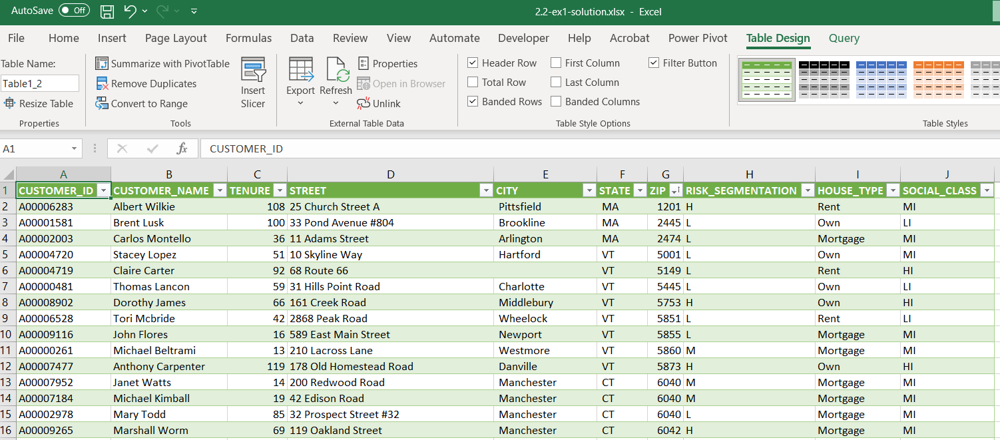
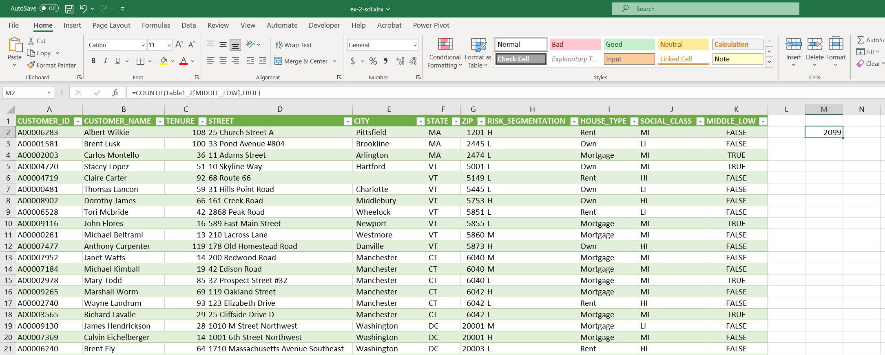

# Virtual Machine (VM) Exercises

## :information_source: Read this before getting started
- The two exercises should not replicate the exact actions shown in your screencast. The goal of exercises is for learners to apply what was learned in the screencasts to new problems or situations. This is best pedagogical practice for retaining and building skills. For example, this can be done by using another dataset between screencasts and exercises or focusing on a different portion of the dataset.
- We can only run free versions of BI software in our virtual machine exercises. In the case of Power BI, make sure the exercises can run on [Power BI Desktop](https://powerbi.microsoft.com/en-us/desktop/) without any additional paid products. 
- Unsure what the scope of an exercise should be? Here's an [example](https://campus.datacamp.com/courses/introduction-to-power-bi/getting-started-with-power-bi?ex=14) from Introduction to Power BI. The first chapter of most DataCamp courses are free, so take a look at our [BI courses](https://learn.datacamp.com/courses?technologies=Tableau&technologies=Power%20BI) to get a feel for how we assess and guide learners.

## 1st VM Exercise

#### Dataset

- [x] Add datasets used to the `datasets/` folder

#### Files

- [x] **Initial**: Add file to the `exercises/`  folder with the name `ex-1-intial.twbx` or `ex-1-intial.pbix`, depending if you are auditioning for a Tableau or Power BI course.
- [x] **Solution**: Add file to the `exercises/`  folder with the name `ex-1-sol.twbx` or `ex-1-sol.pbix`

#### Learning Objective

*Split a column into multiple columns.*

#### Context

*Text often has delimiters, which are useful for splitting apart different parts of the text. For instance, addresses are often stored with commas between their different parts (e.g., street address, city, state, and zip). You can leverage the comma delimiter as a splitting point to separate the different parts into different columns. This makes the data more suitable for structured forms like in relational databases.*

#### Steps to be executed by the student (max 6)

*Each bulleted instruction is a complete sentence that describes a specific task.*

- Load `ex-1-initial.csv` into Power Query.
- Highlight the `FULL ADDRESS` column.
- In the *Home* ribbon, select *Split Column >> By Delimiter*.
- In the *Select or enter delimiter* pull-down, select *Comma*. For the *Split at* option, select *Each occurrence of the delimiter*. Click OK.
- Rename the four new columns as `STREET`, `CITY`, `STATE`, and `ZIP`.
- Click *Home >> Close & Load* to import the data into Excel. You should see a new worksheet containing the new data.

#### Exercise question:
*If you sort the ZIP column from smallest to largest, what is the first zip code?*

#### End goal:

## 2nd VM Exercise

#### Dataset

- [x] Add datasets used to the `datasets/` folder

#### Files

- [x] **Initial**: Add file to the `exercises/`  folder with the name `ex-2-intial.twbx` or `ex-2-intial.pbix`, depending if you are auditioning for a Tableau or Power BI course.
- [x] **Solution**: Add file to the `exercises/`  folder with the name `ex-2-sol.twbx` or `ex-2-sol.pbix`

#### Learning Objective

*Create a new custom column using a formula.*

#### Context

*Thoughtfully adding new columns enriches your data set with more information. This can result in better visualizations and models. In this exercise, you will create a new custom column to identify insurance customers that fall in the middle class and low risk categories.*

#### Steps to be executed by the student (max 6)

*Each bulleted instruction is a complete sentence that describes a specific task.*

- Load `ex-2-initial.csv` into Power Query.
- On the *Add Column* ribbon, click `Custom Column`.
- Name the column `MIDDLE_LOW`.
- Enter the formula that results in TRUE if SOCIAL_CLASS is middle class and RISK_SEGMENTATION is low. Click OK.
- Click Home >> Close & Load to import the data into Excel. You should see a new worksheet containing the new data.

#### Exercise question:
*Use Excel's COUNTIF function to count the true values in MIDDLE_LOW. How many customers fall in the middle class and low risk categories?*

#### End goal:

